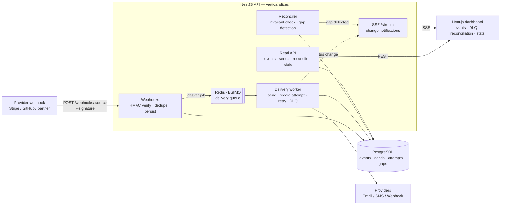
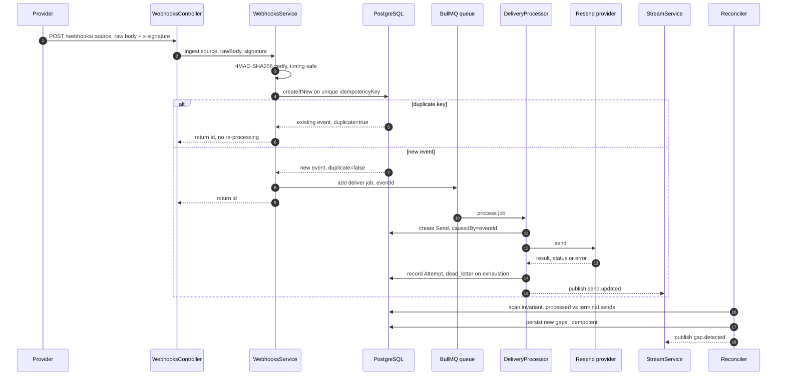
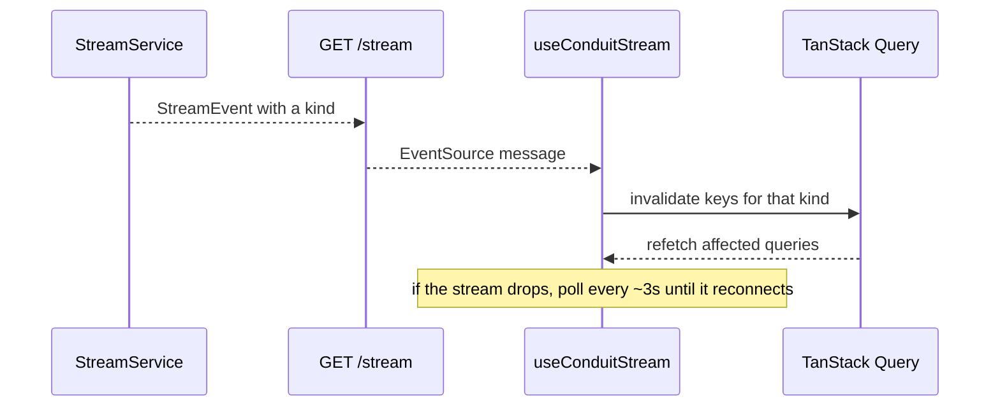
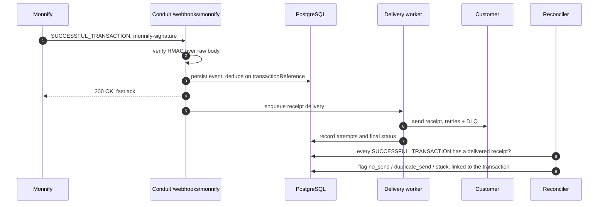

<div align="center">

#  Conduit

### The Event Reliability SDK — receive, deliver, and reconcile every event, _with proof_.

**If you receive webhooks and send anything in response, you already need this.**

<br/>

[](https://apiconf.net/hackathon)


<br/>

<samp>[**Problem**](#problem-statement)&nbsp;&nbsp;·&nbsp;&nbsp;[**Metric**](#the-defensible-metric)&nbsp;&nbsp;·&nbsp;&nbsp;[**Architecture**](#system-architecture)&nbsp;&nbsp;·&nbsp;&nbsp;[**Monnify**](#monnify-integration)&nbsp;&nbsp;·&nbsp;&nbsp;[**API**](#api-documentation)&nbsp;&nbsp;·&nbsp;&nbsp;[**Quickstart**](#installation)</samp>

</div>

---

**Conduit** is a drop-in service and companion dashboard that makes event-driven plumbing reliable end to end. It **ingests inbound webhooks exactly once**, **delivers the resulting outbound notifications** (email / SMS / webhook) with retries and a dead-letter queue, and **continuously reconciles the two sides** so a developer can prove no event was lost, duplicated, or silently dropped. The webhook handler and the sender are the two ends of one pipe; the reconciler is the audit layer that makes the pipe trustworthy — turning three fragile, hand-rolled tools into one coherent product.

>  **Built for the [APIConf 2026 Lagos Developer Challenge](https://apiconf.net/hackathon) — "Build with Monnify."** Conduit is the reliability and reconciliation layer for [Monnify](https://monnify.com) payment webhooks: it ingests Monnify's transaction events **exactly once**, delivers the resulting receipts, and **proves** every successful payment was accounted for — no duplicate credits, no missed settlements, nothing silently dropped. Built against the Monnify **sandbox**. `#APIConfMonnifyDeveloperChallenge`

---

## Table of Contents

- [Problem Statement](#problem-statement)
- [Why Conduit](#why-conduit)
- [Solution Overview](#solution-overview)
- [The Defensible Metric](#the-defensible-metric)
- [Key Features](#key-features)
- [Screenshots](#screenshots)
- [Demo](#demo)
- [Tech Stack](#tech-stack)
- [System Architecture](#system-architecture)
- [How It Works](#how-it-works)
- [Monnify Integration](#monnify-integration)
- [Project Structure](#project-structure)
- [Installation](#installation)
  - [Prerequisites](#prerequisites)
  - [Environment Variables](#environment-variables)
  - [Running the Project](#running-the-project)
  - [Database Setup](#database-setup)
- [API Documentation](#api-documentation)
- [Authentication Flow](#authentication-flow)
- [Frontend Architecture](#frontend-architecture)
- [Backend Architecture](#backend-architecture)
- [Database Schema Overview](#database-schema-overview)
- [State Management](#state-management)
- [Design Decisions](#design-decisions)
- [Performance Optimizations](#performance-optimizations)
- [Security Considerations](#security-considerations)
- [Accessibility Considerations](#accessibility-considerations)
- [Error Handling Strategy](#error-handling-strategy)
- [Testing](#testing)
- [Deployment Guide](#deployment-guide)
- [CI/CD](#cicd)
- [Implementation Status](#implementation-status)
- [Future Improvements](#future-improvements)
- [Known Limitations](#known-limitations)
- [Contributors](#contributors)
- [License](#license)
- [Acknowledgements](#acknowledgements)

---

## Problem Statement

Every product that takes payments talks to a gateway over webhooks. A gateway like **Monnify** fires a webhook for every transaction event — a successful payment, a settlement, a disbursement, a refund — and your backend reacts to it: credit a wallet, send a receipt, notify a partner. **This plumbing is where money quietly goes wrong:**

<table>
  <tr>
    <td width="34" align="center" valign="top"></td>
    <td><b>Duplicate delivery.</b> The same transaction webhook arrives twice — delivery is <b>at-least-once by design</b> — so the customer is credited twice or emailed two receipts.</td>
  </tr>
  <tr>
    <td align="center" valign="top"></td>
    <td><b>Lost on crash.</b> A <code>SUCCESSFUL_TRANSACTION</code> is received but the process crashes before finishing; the wallet is never credited and nobody notices.</td>
  </tr>
  <tr>
    <td align="center" valign="top"></td>
    <td><b>Silently dropped.</b> The receipt provider is briefly down and the notification is simply lost.</td>
  </tr>
  <tr>
    <td align="center" valign="top"></td>
    <td><b>Unprovable at month-end.</b> Finance asks <i>"did every successful Monnify payment send its receipt, and does our ledger match the gateway's?"</i> — and nobody can answer.</td>
  </tr>
</table>

The same failure modes apply to any webhook source (GitHub, a partner API), but with payments they cost real money and trust. Teams solve this ad hoc, badly, once per project.

## Why Conduit

**Every fintech, SaaS, and marketplace speaks webhooks — and every one of them re-solves the same problem.** Payment processors, git hosts, and partner APIs fire billions of webhooks a day, each with at-least-once delivery, which means duplicates and retries are not edge cases — they are the contract. The failures are silent until they are expensive: a double charge, a missing receipt, a compliance question nobody can answer.

Today, teams have two bad options — Conduit is the third:

<table>
  <tr>
    <th width="33%"> Roll it yourself</th>
    <th width="33%"> Trust a black box</th>
    <th width="33%"> Conduit</th>
  </tr>
  <tr>
    <td valign="top">Rebuild idempotency, retries, backoff, a dead-letter queue, and a reconciliation job in <b>every</b> service — and hope you got the edge cases right.</td>
    <td valign="top">Adopt a delivery tool that hides the internals, and simply <b>believe it</b> when it says everything shipped.</td>
    <td valign="top"><b>One-line integration <i>and</i> a verifiable guarantee.</b> Idempotent by default, with the reliability and reconciliation state fully visible and queryable.</td>
  </tr>
</table>

That third path is the wedge. Sending is idempotent by default (the magic), but the reliability and reconciliation state is fully visible, queryable, and controllable (the transparency). For anything touching money, audit, or correctness, developers distrust magic — so letting a skeptical engineer _inspect_ the event log and _prove_ the invariant holds is the differentiator, not a footnote.

> Conduit unifies three ideas that are usually three separate tools: webhook idempotency/reliability, multi-channel delivery, and reconciliation — under one thesis: _reliable event delivery, end to end, with proof._

## Solution Overview

Conduit is the reusable answer. Drop it in and inbound-to-outbound event flow becomes **reliable and auditable** without rebuilding idempotency, retries, and reconciliation every time.

**The system is three parts on one pipe:**

<table>
  <tr>
    <td width="33%" valign="top">
      <h4> A · Webhook Handler</h4>
      <sub>INBOUND</sub><br/><br/>
      Verifies HMAC signatures, assigns an idempotency key, and persists the raw event durably <b>before</b> any processing — so a duplicate or a crash can never cause a double effect or a lost event.
    </td>
    <td width="33%" valign="top">
      <h4> B · Delivery / Sender</h4>
      <sub>OUTBOUND</sub><br/><br/>
      A unified send API routed to providers, with retries (exponential backoff + jitter), a dead-letter queue (DLQ), and one-click / API replay.
    </td>
    <td width="33%" valign="top">
      <h4> C · Reconciler</h4>
      <sub>AUDIT</sub><br/><br/>
      Continuously checks the invariant — <i>every processed inbound event has its expected outbound send in a terminal state</i> — and surfaces gaps (<code>no_send</code>, <code>orphan_send</code>, <code>duplicate_send</code>, <code>stuck</code>) immediately, with an exportable report.
    </td>
  </tr>
</table>

The `causedBy` field is the thread that links every outbound send back to the inbound event that caused it, which is what lets the reconciler tie the two ends together.

## The Defensible Metric

The claim isn't "trust us" — it's measurable. The test: run **N events with injected duplicates, ~15% provider failures, and a mid-processing crash**, first through a naive receiver (processes every webhook and fires sends inline, no idempotency, no retry, no reconciliation), then through Conduit.

<div align="center">


</div>

| Metric                              | Naive baseline        | With Conduit            |
| ----------------------------------- | --------------------- | ----------------------- |
| Duplicate outbound sends            | occurs on every retry | **0** — idempotency     |
| Events received but not acted on    | lost on crash         | **0** — durable log     |
| Failed sends recovered              | lost                  | **100%** via DLQ replay |
| Injected reconciliation gaps caught | undetected            | **100%**                |

> These are the targets the design is built to hit; the real figures come from the reproducible harness, so they are defensible under scrutiny rather than marketing numbers. See [Implementation Status](#implementation-status) for exactly which pieces are live versus stubbed today.

**Demo in under three minutes:** start the seed generator → open an event and watch its delivery timeline (attempts + backoff gaps) → point at the duplicate-webhook counter (processed once, not twice) → open the DLQ, replay a failed send, watch it go green → open the reconciliation dashboard, see an injected gap flagged, and click through to its source event.

## Key Features

<table>
  <tr>
    <td width="33%" valign="top">
      <h4> Exactly-once ingest</h4>
      A unique <code>idempotencyKey</code> constraint makes a duplicate webhook return the original event instead of re-processing it.
    </td>
    <td width="33%" valign="top">
      <h4> Durable before processing</h4>
      The raw event is persisted before any work, so a mid-processing crash never loses it.
    </td>
    <td width="33%" valign="top">
      <h4> Reliable delivery</h4>
      A BullMQ-backed queue drives retries with exponential backoff + jitter and dead-letters exhausted sends.
    </td>
  </tr>
  <tr>
    <td valign="top">
      <h4> One-click / API replay</h4>
      Dead-lettered sends can be re-enqueued individually or in bulk — idempotently, so a double-click can't double-send.
    </td>
    <td valign="top">
      <h4> Continuous reconciliation</h4>
      A background reconciler detects and persists gaps between events and their expected sends, and links each to its source.
    </td>
    <td valign="top">
      <h4> Live dashboard</h4>
      A Next.js app with a live event stream, DLQ + replay UI, and a reconciliation gap explorer.
    </td>
  </tr>
  <tr>
    <td valign="top">
      <h4> Live, with graceful degradation</h4>
      Server-Sent Events push change notifications, with an automatic polling fallback if the stream drops.
    </td>
    <td valign="top">
      <h4> Typed, shared contract</h4>
      One <code>@conduit/contracts</code> package is the source of truth for every DTO, enum, and route — imported by both apps.
    </td>
    <td valign="top">
      <h4> Signed &amp; validated</h4>
      HMAC-verified webhooks over raw bytes, strict request validation, and a single typed error envelope everywhere.
    </td>
  </tr>
</table>

## Screenshots

> Placeholder tiles below — swap for real captures in `docs/screenshots/` before submission.

<div align="center">

<table>
  <tr>
    <td align="center"><br/><sub><b>Events stream</b> — live, filterable, cursor-paginated</sub></td>
    <td align="center"><br/><sub><b>Reconciliation</b> — gaps grouped by type, deep-linked</sub></td>
  </tr>
  <tr>
    <td align="center"><br/><sub><b>DLQ + replay</b> — per-row & bulk, optimistic</sub></td>
    <td align="center"><br/><sub><b>Delivery timeline</b> — every attempt + backoff gap</sub></td>
  </tr>
</table>

</div>

## Demo

**In under three minutes — the storyboard:**

<table>
  <tr>
    <td width="40" align="center"></td>
    <td>Start the seed generator — realistic events stream into the table <b>live</b>.</td>
  </tr>
  <tr>
    <td align="center"></td>
    <td>Open an event — see the <b>delivery timeline</b>: each attempt, its status, error, and backoff gap.</td>
  </tr>
  <tr>
    <td align="center"></td>
    <td>Point at the <b>duplicate-webhook counter</b> — the event was processed once, not twice.</td>
  </tr>
  <tr>
    <td align="center"></td>
    <td>Open the <b>DLQ</b>, replay a failed send, and watch it recover.</td>
  </tr>
  <tr>
    <td align="center"></td>
    <td>Open the <b>reconciliation dashboard</b> — an injected gap is flagged and links straight to its source event.</td>
  </tr>
</table>

**Links** _(fill in once deployed):_

- **Live app:** `https://<your-vercel-app>.vercel.app` _(placeholder)_
- **API:** `https://<your-render-service>.onrender.com` _(placeholder)_
- **Demo video:** `<link>` _(placeholder)_

---

## Tech Stack

**Monorepo:** [Turborepo](https://turbo.build) + [pnpm](https://pnpm.io) workspaces, TypeScript throughout, ESLint 9 + Prettier, shared version pins via the pnpm `catalog:` protocol.

| Layer              | Technology                                                                                    |
| ------------------ | --------------------------------------------------------------------------------------------- |
| **Frontend**       | Next.js 16 (App Router, React 19), TanStack Query 5, Zustand 5, Tailwind CSS v4               |
| **Backend**        | NestJS 11 (Express platform), RxJS, `class-validator` / `class-transformer`                   |
| **Database**       | PostgreSQL 16, Prisma 7 (new `prisma-client` generator + `@prisma/adapter-pg` driver adapter) |
| **Queue / jobs**   | Redis 7 + BullMQ 5 (`@nestjs/bullmq`)                                                         |
| **Realtime**       | Server-Sent Events (NestJS `@Sse` + RxJS), client `EventSource` with polling fallback         |
| **Payments**       | Monnify APIs (sandbox) — transaction, settlement, disbursement, and refund webhooks           |
| **Email provider** | Resend (`resend` SDK)                                                                         |
| **Validation**     | Zod 4 (env + shared request schemas), NestJS `ValidationPipe`                                 |
| **Authentication** | HMAC-SHA256 webhook signature verification (see [Authentication Flow](#authentication-flow))  |
| **AI / ML**        | Not applicable — Conduit contains no AI/ML functionality.                                     |
| **Infrastructure** | Docker Compose (local Postgres + Redis)                                                       |
| **Deployment**     | API → Render (`render.yaml`); Web → Vercel                                                    |

---

## System Architecture

Conduit is a **Turborepo monorepo** with two deployables — a NestJS API and a Next.js dashboard — plus a framework-agnostic `@conduit/contracts` package that both import, so the wire format can never drift. The API is built as **vertical feature slices** behind a single uniform request pipeline; the queue **decouples fast, durable ingest from slower, fallible delivery**; and a reconciler audits the two ends against a single invariant.

### Guiding principles

- **Contract-first** — every DTO, enum, route, and request schema lives in one package; nothing is redefined at either edge.
- **Persist before you process** — inbound events are durable before any work, so a crash is recoverable by construction.
- **Decouple ingest from delivery** — ingest only validates, deduplicates, persists, and enqueues; all fallible outbound work happens asynchronously in a worker.
- **One error shape, one time format** — every non-2xx response is the `ApiError` envelope; every timestamp is ISO 8601 UTC; absent values are `null`.
- **Repository boundary** — Prisma is imported only inside `*.repository.ts`; services stay persistence-agnostic.

### High-level topology



### Component responsibilities

| Component           | Module (`apps/api/src/modules/…`) | Responsibility                                                                           |
| ------------------- | --------------------------------- | ---------------------------------------------------------------------------------------- |
| **Webhook handler** | `webhooks`                        | Verify HMAC over raw bytes, extract the idempotency key, persist once, enqueue a job.    |
| **Read API**        | `events`                          | Cursor-paginated event list and event detail (with nested sends + attempts).             |
| **Delivery worker** | `delivery`                        | Consume jobs, create sends, call the provider, record attempts, retry with backoff, DLQ. |
| **Sends API**       | `delivery`                        | List sends (DLQ = `dead_lettered`) and replay a dead-lettered send (idempotent).         |
| **Reconciler**      | `reconciliation`                  | Check the invariant, detect and persist gaps idempotently, serve the report.             |
| **Stream**          | `stream`                          | Publish change notifications to SSE subscribers (+ heartbeat).                           |
| **Stats**           | `stats`                           | Aggregate dashboard counts.                                                              |
| **Shared contract** | `packages/contracts`              | DTOs, enums, routes, request/SSE schemas — imported by both apps.                        |

### Request lifecycle — inbound webhook to reconciled



### API request pipeline

Every request flows through the same layers, configured globally in `main.ts`:

```
raw body capture  →  CORS (WEB_ORIGIN)  →  ValidationPipe (whitelist + transform)
    →  Controller  →  Service  →  Repository (Prisma)  →  Mapper → DTO
Errors ─────────────────────────────────────────────►  AllExceptionsFilter → ApiError envelope
Every request ─────────────────────────────────────►  LoggingInterceptor
```

`rawBody: true` is enabled at bootstrap specifically so the webhook handler can compute HMAC over the exact received bytes — parsing then re-serializing would change them and break signature verification.

### Realtime & cache-invalidation flow

The stream is deliberately "dumb": it broadcasts _that_ something changed, not the diff. The client maps each event kind to a targeted TanStack Query invalidation and refetches — far less error-prone than streaming state, and it degrades cleanly.



### Data flow & the `causedBy` thread

`webhook_events` is the source of truth. Each `Send` carries `causedBy = event.id`, and each `Attempt` carries `sendId` — so the full chain **event → send → attempt** is walkable in both directions. The reconciler relies on exactly this thread to answer _"does every processed event have its expected send in a terminal state, and does every send trace back to an event?"_ Gaps reference the offending `eventId` and/or `sendId`, which is what powers the dashboard's deep-link from a gap straight to its source event.

### Scalability & deployment topology

- **Stateless API** — the HTTP surface holds no per-request state, so it scales horizontally behind a load balancer.
- **Queue as a shock absorber** — BullMQ decouples ingest from delivery, so a burst of webhooks or a downstream provider outage is absorbed by the queue instead of dropping events or blocking the request path. The worker can run as its own process and scale independently of the API.
- **Database access patterns** — every list endpoint is cursor-paginated (no `OFFSET` scans), backed by composite indexes matching the dashboard's queries (`(status, receivedAt)`, `(source, receivedAt)`, `(status, createdAt)`, `causedBy`, `(type, detectedAt)`).
- **Redis** already backs the queue and is the natural backend for multi-instance SSE fan-out (pub/sub) as the fleet grows.

> **Current single-instance caveats (hackathon stage):** the delivery worker runs **in-process** with the API, and `StreamService` uses an in-memory subject — so horizontal scaling of SSE would need a Redis-backed fan-out, and the worker would be split into its own process. These are deployment changes, not redesigns; the queue boundary already makes them drop-in. See [Known Limitations](#known-limitations).

### Failure model & guarantees

| Failure injected                    | How Conduit contains it                                                         |
| ----------------------------------- | ------------------------------------------------------------------------------- |
| Provider re-delivers the same event | Unique `idempotencyKey` → the duplicate returns the original; no re-processing. |
| Process crashes mid-processing      | Event is persisted _before_ any work → recoverable; nothing is lost.            |
| Outbound provider is down / flaky   | Retries with exponential backoff + jitter; exhausted sends land in the DLQ.     |
| A send is stuck or never happened   | The reconciler flags it (`stuck` / `no_send`) and links it to the source event. |
| A send has no source event          | The reconciler flags it (`orphan_send`).                                        |

---

## How It Works

### Core Workflow

<table>
  <tr>
    <td width="52" align="center" valign="top"><br/><sub><b>1</b></sub></td>
    <td><b>Receive.</b> A provider POSTs to <code>/webhooks/:source</code>. The handler verifies the HMAC signature over the exact raw bytes, extracts an idempotency key (<code>idempotencyKey</code> or <code>id</code> from the payload), and persists the event. A duplicate key returns the original event and is <b>not</b> re-processed.</td>
  </tr>
  <tr>
    <td align="center" valign="top"><br/><sub><b>2</b></sub></td>
    <td><b>Enqueue.</b> For genuinely new events, a <code>deliver</code> job is added to the BullMQ delivery queue — the inbound-to-outbound hand-off.</td>
  </tr>
  <tr>
    <td align="center" valign="top"><br/><sub><b>3</b></sub></td>
    <td><b>Deliver.</b> The delivery worker creates <code>Send</code> rows (linked by <code>causedBy</code>), delivers via the provider, records each <code>Attempt</code>, retries with exponential backoff + jitter, and dead-letters after the max attempts.</td>
  </tr>
  <tr>
    <td align="center" valign="top"><br/><sub><b>4</b></sub></td>
    <td><b>Reconcile.</b> A background reconciler checks the invariant and persists any newly-detected gaps, idempotently (an open gap for the same <code>(type, event, send)</code> is not re-emitted).</td>
  </tr>
  <tr>
    <td align="center" valign="top"><br/><sub><b>5</b></sub></td>
    <td><b>Observe.</b> The dashboard reads events, sends, gaps, and stats over REST, and subscribes to <code>/stream</code> (SSE) to refetch on change — falling back to polling if the stream drops.</td>
  </tr>
</table>

---

## Monnify Integration

Conduit models **Monnify as a first-class webhook source**. Monnify posts transaction notifications to a single endpoint, and Conduit gives those notifications the reliability guarantees payments demand.

**Endpoint.** Point your Monnify (sandbox) webhook URL at:

```
POST /webhooks/monnify
```

**Event types.** Conduit ingests Monnify's transaction events — `SUCCESSFUL_TRANSACTION`, `SETTLEMENT`, `SUCCESSFUL_DISBURSEMENT`, `FAILED_DISBURSEMENT`, `REFUND_COMPLETED` — recording each as a `WebhookEvent` whose `type` is the Monnify `eventType`.

**Idempotency.** Monnify's `transactionReference` is unique per transaction, which makes it the natural idempotency key — so a retried notification returns the original event instead of crediting a wallet or emailing a receipt twice.

**The flow, applied to Monnify:**



**Sample Monnify webhook → `WebhookEvent`.** A Monnify transaction notification maps onto Conduit's contract like this:

```jsonc
// Monnify posts (shape simplified):
{
  "eventType": "SUCCESSFUL_TRANSACTION",
  "eventData": {
    "transactionReference": "MNFY|20260719|0001",
    "paymentReference": "order_4821",
    "amountPaid": "4200.00",
    "paidOn": "2026-07-19T12:00:00Z",
    "customer": { "email": "ada@example.com" },
  },
}
```

```jsonc
// Conduit stores it as a WebhookEvent:
{
  "id": "3f2c…", // internal uuid
  "source": "monnify",
  "type": "SUCCESSFUL_TRANSACTION", // ← eventType
  "idempotencyKey": "MNFY|20260719|0001", // ← eventData.transactionReference (unique)
  "status": "received",
  "payload": {/* the full raw Monnify body */},
  "receivedAt": "2026-07-19T12:00:00.100Z",
  "processedAt": null,
}
```

The resulting receipt is a `Send` with `causedBy` set to this event's `id`, so the reconciler can later prove the payment produced exactly one delivered receipt.

**Configuration.** Set `WEBHOOK_SECRET_MONNIFY` to your Monnify client secret and run against the Monnify **sandbox** while testing.

> **Integration status (honest):** the webhook handler is **source-generic** — it verifies an HMAC over the raw bytes and extracts the idempotency key from the payload, so `monnify` works as a source today. Monnify's exact scheme (a **SHA-512** HMAC in the `monnify-signature` header, and mapping `eventData.transactionReference` → idempotency key) is the per-source adaptation, tracked in [Implementation Status](#implementation-status). Nothing here claims a live Monnify call that isn't in the code.

---

## Project Structure

<details>
<summary><b>Repository layout</b> — two apps + a shared contract package (click to expand)</summary>

```
conduit/
├── apps/
│   ├── api/                        # NestJS service
│   │   ├── prisma/
│   │   │   ├── schema.prisma        # data model (events, sends, attempts, gaps)
│   │   │   ├── migrations/
│   │   │   └── seed.ts              # realistic events, sends, attempts, DLQ + a gap
│   │   └── src/
│   │       ├── main.ts              # bootstrap: rawBody, ValidationPipe, filter, CORS
│   │       ├── app.module.ts        # composition of feature modules
│   │       ├── config/              # zod-validated env + typed config service
│   │       ├── common/
│   │       │   ├── prisma/          # PrismaService (driver adapter)
│   │       │   ├── filters/         # AllExceptionsFilter → ApiError envelope
│   │       │   ├── interceptors/    # request logging
│   │       │   └── pagination/      # cursor helpers
│   │       ├── queue/               # BullMQ names + job types
│   │       └── modules/             # vertical slices (controller · service · repository · mapper)
│   │           ├── webhooks/        # BE1 — ingest (HMAC, dedupe, persist, enqueue)
│   │           ├── events/          # BE1 — read API (list + detail)
│   │           ├── delivery/        # BE2 — sends, retry, DLQ, worker, Resend provider
│   │           ├── reconciliation/  # BE2 — invariant + gap detection
│   │           ├── stream/          # BE2 — SSE
│   │           ├── stats/           # BE2 — dashboard counts
│   │           └── health/          # liveness
│   └── web/                         # Next.js App Router dashboard
│       └── src/
│           ├── app/                 # routes: /events, /events/[id], /dlq, /reconciliation
│           ├── components/ui/       # shared presentational primitives
│           ├── features/            # feature slices: <domain>/{api,hooks,components}
│           │   ├── events/          # list, detail, delivery timeline, filters, highlight
│           │   ├── delivery/        # DLQ, replay, bulk replay
│           │   ├── reconciliation/  # gaps, deep-link, CSV export, health strip
│           │   └── stats/           # overview counts
│           ├── lib/                 # api-client, query-client, query-keys, sse, filters, format
│           ├── stores/              # Zustand: filters, selection, toast, streaam
│           └── mocks/               # API-shaped fixtures + adapter (mock mode)
├── packages/
│   ├── contracts/                  # shared DTOs, enums, zod schemas, routes, SSE contract (source of truth)
│   ├── tsconfig/                   # shared TS base configs
│   └── eslint-config/              # shared ESLint config
├── docker-compose.yml              # local Postgres (5435) + Redis (6380)
├── render.yaml                     # API deployment (Render)
├── turbo.json                      # task graph
└── pnpm-workspace.yaml             # workspaces + version catalog
```

</details>

`packages/contracts` is the backbone: **no wire type is defined outside it**, and both apps import it, so the frontend and backend can never drift.

---

## Installation

### Prerequisites

- **Node.js ≥ 20.19** (24 recommended)
- **pnpm 9** (`corepack enable` will provision the pinned `pnpm@9.15.9`)
- **Docker** (for local Postgres + Redis)

### Environment Variables

Copy the example and fill in secrets:

```bash
cp .env.example .env
```

<details>
<summary><b>All environment variables</b> (click to expand)</summary>

<br/>

| Variable                  | Scope | Description                                                                                                                                                               |
| ------------------------- | ----- | ------------------------------------------------------------------------------------------------------------------------------------------------------------------------- |
| `DATABASE_URL`            | API   | PostgreSQL connection string. Defaults point at the Docker service on host port **5435**.                                                                                 |
| `REDIS_URL`               | API   | Redis connection string. Defaults to the Docker service on host port **6380**.                                                                                            |
| `API_PORT`                | API   | Port the NestJS API listens on (default `3001`).                                                                                                                          |
| `WEB_ORIGIN`              | API   | Allowed CORS origin (default `http://localhost:3000`).                                                                                                                    |
| `RESEND_API_KEY`          | API   | Resend API key for email delivery. Optional in dev (a stub key is used).                                                                                                  |
| `EMAIL_FROM`              | API   | From-address for outbound email.                                                                                                                                          |
| `WEBHOOK_SECRET_<SOURCE>` | API   | Per-source HMAC secret, e.g. `WEBHOOK_SECRET_MONNIFY` (your Monnify client secret). If unset for a source, signature verification is **skipped in dev** (with a warning). |
| `NEXT_PUBLIC_API_URL`     | Web   | Base URL of the API (exposed to the browser).                                                                                                                             |
| `NEXT_PUBLIC_USE_MOCKS`   | Web   | `true` renders every view against in-memory fixtures; `false` hits the live API.                                                                                          |

</details>

> The API validates its environment at boot with Zod (`apps/api/src/config/env.schema.ts`) — an invalid or missing required variable fails fast with a clear message.

### Running the Project

```bash
pnpm install                 # install all workspaces
docker compose up -d         # Postgres (5435) + Redis (6380)
pnpm db:generate             # generate the Prisma 7 client (src/generated/prisma)
pnpm db:migrate              # apply migrations
pnpm db:seed                 # seed realistic data + one injected gap
pnpm dev                     # Turbo runs API (:3001) and Web (:3000) together
```

Run the two apps individually if you prefer:

```bash
# Backend (NestJS, watch mode)
pnpm --filter @conduit/api dev

# Frontend (Next.js)
pnpm --filter @conduit/web dev
```

> **Mock mode:** the web app ships with `NEXT_PUBLIC_USE_MOCKS=true` in `apps/web/.env.local`, so every screen renders against realistic fixtures before the API is up. Flip it to `false` (and set `NEXT_PUBLIC_API_URL`) to hit the live backend.

### Database Setup

Prisma 7 uses the new `prisma-client` generator with a Postgres **driver adapter**; the connection URL lives in `prisma.config.ts` / `DATABASE_URL`, not in `schema.prisma`.

```bash
pnpm db:generate         # regenerate the client after schema changes
pnpm db:migrate          # create/apply a dev migration
pnpm db:seed             # seed sample data
pnpm --filter @conduit/api db:studio   # open Prisma Studio
```

For production migrations (used by the Render start command):

```bash
pnpm --filter @conduit/api db:migrate:deploy
```

---

## API Documentation

Base URL: `http://localhost:3001`. All list endpoints are **cursor-paginated** and return the `Paginated<T>` envelope. All non-2xx responses return the shared `ApiError` envelope. There is **no Swagger/OpenAPI document** in the repository yet — the contract lives in `packages/contracts` (routes in `src/routes.ts`, DTOs in `src/dto`).

| Method | Path                | Description                                                                |
| ------ | ------------------- | -------------------------------------------------------------------------- |
| `POST` | `/webhooks/:source` | Ingest a webhook: HMAC verify → dedupe → persist → enqueue.                |
| `GET`  | `/events`           | List events (cursor + filters: `status`, `source`, `from`, `to`, `limit`). |
| `GET`  | `/events/:id`       | Event detail with nested sends and attempts.                               |
| `GET`  | `/sends`            | List sends (filter by `status`; DLQ = `dead_lettered`).                    |
| `POST` | `/sends/:id/replay` | Re-enqueue a dead-lettered send (idempotent).                              |
| `GET`  | `/reconcile`        | Reconciliation report (`Gap[]` + summary; optional `from`/`to`).           |
| `GET`  | `/stream`           | Server-Sent Events: pushes event / send / gap change notifications.        |
| `GET`  | `/stats`            | Dashboard counts.                                                          |
| `GET`  | `/health`           | Liveness probe.                                                            |

### Request / Response Examples

<details>
<summary><b>Show request/response examples</b> — ingest, list, reconcile, error envelope</summary>

<br/>

**Ingest a webhook**

```bash
curl -X POST http://localhost:3001/webhooks/monnify \
  -H "Content-Type: application/json" \
  -H "x-signature: <hex HMAC-SHA256 of the raw body>" \
  -d '{ "eventType": "SUCCESSFUL_TRANSACTION", "eventData": { "transactionReference": "MNFY|20260719|0001", "amountPaid": "4200.00" } }'
```

```jsonc
// 201 Created
{ "id": "3f2c…", "duplicate": false }
```

**List events**

```bash
curl "http://localhost:3001/events?status=failed&limit=20"
```

```jsonc
// 200 OK — Paginated<EventDto>
{
  "items": [
    {
      "id": "evt_2",
      "source": "github",
      "type": "push",
      "idempotencyKey": "evt_github_002",
      "status": "failed",
      "payload": { "ref": "refs/heads/main" },
      "receivedAt": "2026-07-19T11:58:00.000Z",
      "processedAt": null,
    },
  ],
  "nextCursor": null,
  "total": 1,
}
```

**Event detail** (`GET /events/:id`) returns the event plus `sends[]`, each with an `attemptHistory[]` (attempt number, status code, error, duration, and `nextRetryAt` for the backoff gap) — this powers the delivery timeline.

**Reconciliation report**

```bash
curl "http://localhost:3001/reconcile"
```

```jsonc
// 200 OK — ReconcileReportDto
{
  "gaps": [
    {
      "id": "gap_1",
      "type": "no_send",
      "eventId": "evt_2",
      "sendId": null,
      "detail": "Processed event evt_2 has no send in a terminal state.",
      "detectedAt": "2026-07-19T12:00:30.000Z",
      "resolvedAt": null,
    },
  ],
  "summary": { "no_send": 1, "orphan_send": 0, "duplicate_send": 0, "stuck": 0, "total": 1 },
  "lastRunAt": "2026-07-19T12:00:30.000Z",
  "invariantHolds": false,
}
```

**Error envelope** (every non-2xx response)

```jsonc
// e.g. 401 Unauthorized
{
  "statusCode": 401,
  "code": "INVALID_SIGNATURE",
  "message": "Invalid signature",
  "timestamp": "2026-07-19T12:00:00.000Z",
  "path": "/webhooks/monnify",
}
```

</details>

**Conventions**

- Timestamps are ISO 8601 UTC strings; absent values are `null`, never `undefined`.
- `Paginated<T>` = `{ items, nextCursor, total }`; `nextCursor: null` means the end.

---

## Authentication Flow

Conduit has no user login — it is a machine-to-machine service. "Authentication" is **provider webhook verification** on ingest:

1. The API is created with `rawBody: true` so the exact received bytes are available.
2. A provider sends the HMAC signature in the `x-signature` header.
3. `WebhooksService.verifySignature` looks up the per-source secret (`WEBHOOK_SECRET_<SOURCE>`), computes `HMAC-SHA256(rawBody, secret)`, and compares it against the header using `crypto.timingSafeEqual` (constant-time, length-checked).
4. A missing or mismatched signature is rejected with `401 INVALID_SIGNATURE`.
5. **Dev fallback:** if no secret is configured for a source, the check is skipped with a warning, so local testing doesn't require secrets.

> Source-specific signature schemes (e.g. Stripe's `t=…,v1=…` format) and hardened per-source secret management are flagged as follow-up work (see [Implementation Status](#implementation-status)).

---

## Frontend Architecture

- **Next.js App Router**, feature-sliced by domain: `features/<domain>/{api,hooks,components}`, with `lib/` (client plumbing), `stores/` (UI state), `mocks/`, and shared `components/ui/`.
- **Clear logic/UI seam:** data hooks and query/mutation options expose typed data and handlers; presentational components consume them. This lets data and design be built in parallel without colliding.
- **Server state vs UI intent:** all server data lives in **TanStack Query**; **Zustand** only holds UI intent (filters, row selection, toasts, stream status) — never a copy of server data.
- **Typed API client** (`lib/api-client.ts`): a thin `fetch` wrapper that unwraps the `ApiError` envelope into a typed `ApiClientError`, and transparently routes to the mock adapter in mock mode.
- **Optimistic mutations:** replay and bulk replay remove sends from the DLQ immediately, keep a snapshot for rollback, and report success/partial-failure via toasts.
- **Live updates:** `useConduitStream` maps SSE events to targeted query invalidations, and falls back to polling every few seconds if the stream can't hold a connection.
- **Cursor pagination:** events and sends expose infinite-query options over the `Paginated<T>` contract.
- **Deep-link contract:** reconciliation gaps link to `/events/[id]?highlight=<sendId>`; the events detail reads the same `highlight` param to focus the offending send.

## Backend Architecture

- **NestJS vertical slices:** each feature module is `controller · service · repository · mapper`, composed in `app.module.ts`.
- **Repository pattern:** Prisma is only imported inside `*.repository.ts`; services stay persistence-agnostic and map rows to DTOs via mappers.
- **Global cross-cutting layers** (wired in `main.ts`):
  - `ValidationPipe` (`whitelist`, `transform`, `forbidNonWhitelisted`) validates and strips request DTOs.
  - `AllExceptionsFilter` renders every error as the shared `ApiError` envelope with a machine-readable `code`.
  - `LoggingInterceptor` logs each request.
  - CORS is restricted to `WEB_ORIGIN`.
- **Config:** `AppConfigService` wraps a Zod-validated environment; unknown keys such as `WEBHOOK_SECRET_*` are read on demand.
- **Persistence:** `PrismaService` connects via the `@prisma/adapter-pg` driver adapter.
- **Queue:** BullMQ (`@nestjs/bullmq`) with a single `delivery` queue; the webhook handler enqueues a `deliver` job carrying `{ eventId }`.
- **Realtime:** the `/stream` controller merges a `StreamService` subject with a 15s heartbeat and serializes `StreamEvent`s as SSE messages.

## Database Schema Overview

PostgreSQL via Prisma. Four tables, linked by `causedBy` (send → event) and the gap references:

| Table            | Purpose                          | Notable columns / constraints                                                                                                   |
| ---------------- | -------------------------------- | ------------------------------------------------------------------------------------------------------------------------------- |
| `webhook_events` | Inbound events (source of truth) | `idempotencyKey` **unique** (the correctness guarantee); `status`; indexes on `(status, receivedAt)` and `(source, receivedAt)` |
| `sends`          | Outbound sends                   | `causedBy` → event (cascade delete); `status`, `attempts`, `lastError`; indexes on `(status, createdAt)` and `causedBy`         |
| `attempts`       | Per-send delivery attempts       | `(sendId, attemptNo)` **unique**; `statusCode`, `error`, `durationMs`, `nextRetryAt`                                            |
| `reconcile_gaps` | Detected reconciliation gaps     | `type`, nullable `eventId` / `sendId` (set-null on delete), `detail`, `detectedAt`, `resolvedAt`; index on `(type, detectedAt)` |

Status vocabularies (from `@conduit/contracts`): `EventStatus` = `received | processing | processed | failed`; `SendStatus` = `pending | sent | failed | dead_lettered`; `GapType` = `no_send | orphan_send | duplicate_send | stuck`.

## State Management

- **TanStack Query** owns all server state, with a centralized query-key factory (`lib/query-keys.ts`) for surgical invalidation and a tuned client (`staleTime`, no retry on 4xx, no retry on mutations since they roll back).
- **Zustand** owns UI intent only: `filters` (URL-synced), `selection` (DLQ multi-select), `toast`, and `stream` status.
- **Mock adapter** (`mocks/`) mirrors the real API — stateful replay, cursor pagination, and query filtering — so the UI is fully exercisable in mock mode.

---

## Design Decisions

- **A frozen, shared contract package.** `@conduit/contracts` is committed first and imported by both apps; no wire type is defined anywhere else, so the two ends cannot drift.
- **"Stripe-clean to call, transparent to inspect."** One-line integration and idempotent-by-default behavior, but the reliability and reconciliation state is fully visible and queryable — never a black box.
- **Idempotency as a database constraint,** not application logic — the `idempotencyKey` unique index makes exactly-once a property of the data, not a race-prone check.
- **Persist before processing** so a crash is recoverable by design.
- **SSE kept deliberately dumb** — it broadcasts "something changed" and the client refetches, rather than streaming diffs, which is far less error-prone and degrades cleanly to polling.
- **Logic/UI seam on the frontend** so data and design work proceed independently.

## Performance Optimizations

- Cursor pagination on every list endpoint (no `OFFSET` scans).
- Targeted composite indexes matching the dashboard's query patterns.
- Optimistic UI updates for instant feedback on replay.
- SSE push instead of aggressive polling, with polling only as a fallback.
- Query `staleTime` and disabled window-focus refetch to avoid redundant network calls.
- Turborepo task caching and a single version `catalog:` so tooling majors bump in one place.

## Security Considerations

<table>
  <tr>
    <td width="34" align="center" valign="top"></td>
    <td><b>Signed webhooks.</b> HMAC-SHA256 over the exact raw request bytes, compared in constant time (<code>timingSafeEqual</code>).</td>
    <td width="34" align="center" valign="top"></td>
    <td><b>Strict validation.</b> <code>ValidationPipe</code> with <code>whitelist</code> + <code>forbidNonWhitelisted</code> strips unknown fields.</td>
  </tr>
  <tr>
    <td align="center" valign="top"></td>
    <td><b>Locked CORS.</b> Requests are restricted to <code>WEB_ORIGIN</code>.</td>
    <td align="center" valign="top"></td>
    <td><b>Validated config.</b> The environment is Zod-checked at boot; the process refuses to start with an invalid config.</td>
  </tr>
  <tr>
    <td align="center" valign="top"></td>
    <td><b>No leaked secrets.</b> Only <code>NEXT_PUBLIC_*</code> values reach the browser.</td>
    <td align="center" valign="top"></td>
    <td><b>Replay-safe.</b> Idempotency prevents duplicate side effects from provider retries.</td>
  </tr>
</table>

> **Note:** in development, signature verification is skipped when a source has no configured secret. Ensure every production source has `WEBHOOK_SECRET_<SOURCE>` set.

## Accessibility Considerations

- Semantic HTML with labelled controls (e.g. `aria-label` on selection checkboxes; toasts use `role="status"`).
- State communicated through text and shape, not color alone.
- Intentional empty, loading, and error states that explain the next step.

> A full audit (keyboard traversal, focus management, contrast) is recommended before release — treat this section as a baseline, not a certification.

## Error Handling Strategy

- **One error shape everywhere:** the API's global filter emits the `ApiError` envelope with a machine-readable `code`; the client unwraps it into a typed `ApiClientError`.
- **Retry policy:** queries skip retries on 4xx (they won't self-heal); mutations never retry (they are optimistic and roll back on failure).
- **Optimistic rollback:** failed replays restore the previous cache snapshot and surface a toast.
- **Every screen** designs its loading, empty, and error states explicitly.

---

## Testing

```bash
pnpm test                              # unit tests across the workspace (Vitest)
pnpm --filter @conduit/web test        # frontend unit tests
pnpm --filter @conduit/api test        # backend unit tests
pnpm --filter @conduit/api test:int    # backend integration tests (needs Postgres + Redis)
```

- **Frontend unit tests** cover the pure logic layer: filter parse/serialize, the gap deep-link contract, the CSV serializer, the age formatter, and the mock adapter's filtering + pagination.
- **Backend** includes unit tests (mappers) and integration specs (`*.int.spec.ts`) for webhook idempotency and the reconciler, which run against real Postgres + Redis via a separate Vitest config.
- **Quality gates:** `pnpm typecheck`, `pnpm lint`, and `pnpm test` run across every package through Turborepo.

---

## Deployment Guide

**API → Render** (`render.yaml`):

- Build: `pnpm install && pnpm turbo run build --filter=@conduit/api && pnpm --filter @conduit/api db:generate`
- Start: `pnpm --filter @conduit/api db:migrate:deploy && pnpm --filter @conduit/api start:prod`
- Health check: `/health`
- Provisions a free Postgres database and Redis instance; set `WEB_ORIGIN`, `RESEND_API_KEY`, and `EMAIL_FROM` as service secrets.

**Web → Vercel:**

- Root directory: `apps/web`
- Build command: `cd ../.. && pnpm turbo run build --filter=@conduit/web`
- Set `NEXT_PUBLIC_API_URL` to the Render API URL and `NEXT_PUBLIC_USE_MOCKS=false`.

**Local infrastructure:** `docker-compose.yml` runs Postgres (host `5435`) and Redis (host `6380`) with health checks.

> **Free-tier caveats (from `render.yaml`):** services sleep after inactivity (cold start ~30s — warm before a demo); the BullMQ worker runs in-process with the API at this stage; SSE relies on the 15s heartbeat + the client polling fallback through the proxy.

## CI/CD

No CI/CD workflows are present in the repository yet (`.github/workflows` does not exist). **Recommended next step:** add a GitHub Actions workflow running `pnpm install`, `pnpm typecheck`, `pnpm lint`, and `pnpm test` on pull requests. _(Placeholder — requires manual completion.)_

---

## Implementation Status

Conduit is a working scaffold with the full contract, schema, and every module and route wired end to end. Read paths (events, sends, reconcile, stats), webhook ingest (idempotent persist + enqueue), and the entire frontend logic layer are implemented and tested. A few correctness-critical backend pieces are intentionally left as clearly-marked `TODO(BEx)` stubs for their owners and are **not yet functional**:

- **Delivery worker** (`delivery.processor.ts`) — real send, `Send`/`Attempt` creation, backoff + jitter, and dead-lettering (currently a logging stub).
- **`POST /sends/:id/replay`** — returns `501 Not Implemented` pending the idempotent re-enqueue.
- **Resend provider** — returns a stubbed `202` instead of performing a live send.
- **Reconciler scheduling** — `runReconciler()` is implemented but not yet wired to a periodic schedule; `orphan_send` detection is pending.
- **`duplicatesRejected` stat** — currently returns `0` (duplicates aren't yet counted in a metric).
- **Hardened per-source HMAC schemes** — beyond the generic HMAC-SHA256 verification, including **Monnify's SHA-512 `monnify-signature`** scheme and mapping `eventData.transactionReference` → idempotency key.

This section is deliberately explicit so reviewers know exactly what is live versus stubbed.

## Future Improvements

- Complete the delivery worker, replay, and scheduled reconciler (the stubs above).
- SMS channel delivery (currently a log-only stub in scope).
- CSV export and time-window gap filtering wired into the reconciliation UI (logic is implemented).
- OpenAPI/Swagger generation from the shared contract.
- CI pipeline and end-to-end tests.
- Multi-tenant support, template design studio, and analytics (explicitly out of the current scope).

## Known Limitations

- Several backend features are stubbed (see [Implementation Status](#implementation-status)).
- On free-tier hosting the worker runs in-process with the API and services cold-start after inactivity.
- No authenticated user layer — Conduit is a machine-to-machine service.
- Signature verification is skipped for sources without a configured secret in development.

---

## Contributors

<div align="center">

 **Four developers · two days · one pipe** — built for the [APIConf 2026 Lagos Developer Challenge](https://apiconf.net/hackathon).

<br/>

<table>
  <tr>
    <td align="center" width="25%" valign="top">
      <a href="https://github.com/Maxima24"></a>
      <br/><br/>
      <a href="https://github.com/Maxima24"><b>@Maxima24</b></a>
      <br/>
      
      <br/><br/>
      <sub> Ingest · persistence<br/>events read API</sub>
      <br/><br/>
      <a href="https://github.com/Maxima24"></a>
    </td>
    <td align="center" width="25%" valign="top">
      <a href="https://github.com/professor-12"></a>
      <br/><br/>
      <a href="https://github.com/professor-12"><b>@professor-12</b></a>
      <br/>
      
      <br/><br/>
      <sub> Delivery · DLQ<br/>reconciler · SSE</sub>
      <br/><br/>
      <a href="https://github.com/professor-12"></a>
    </td>
    <td align="center" width="25%" valign="top">
      <a href="https://github.com/ZEED2468"></a>
      <br/><br/>
      <a href="https://github.com/ZEED2468"><b>@ZEED2468</b></a>
      <br/>
      
      <br/><br/>
      <sub> App shell · event<br/>stream · detail</sub>
      <br/><br/>
      <a href="https://github.com/ZEED2468"></a>
    </td>
    <td align="center" width="25%" valign="top">
      <a href="https://github.com/Ferousco-dev"></a>
      <br/><br/>
      <a href="https://github.com/Ferousco-dev"><b>@Ferousco-dev</b></a>
      <br/>
      
      <br/><br/>
      <sub> DLQ · reconciliation<br/>dashboard · stats</sub>
      <br/><br/>
      <a href="https://github.com/Ferousco-dev"></a>
    </td>
  </tr>
</table>

</div>

## License

No `LICENSE` file is present in the repository yet. _(Placeholder — add a license, e.g. MIT, and update this section and the badge.)_

## Acknowledgements

Built for the **[APIConf 2026 Lagos](https://apiconf.net) Developer Challenge** with [Monnify](https://monnify.com). Powered by [NestJS](https://nestjs.com), [Next.js](https://nextjs.org), [Prisma](https://www.prisma.io), [BullMQ](https://docs.bullmq.io), [TanStack Query](https://tanstack.com/query), [Zustand](https://zustand-demo.pmnd.rs), [Tailwind CSS](https://tailwindcss.com), [Resend](https://resend.com), and [Turborepo](https://turbo.build).
